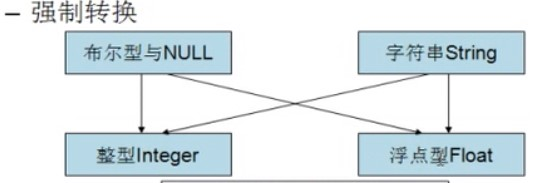
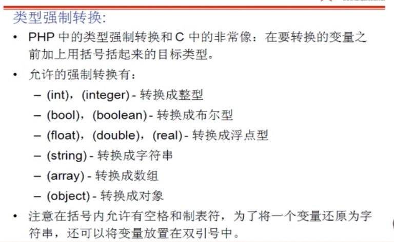
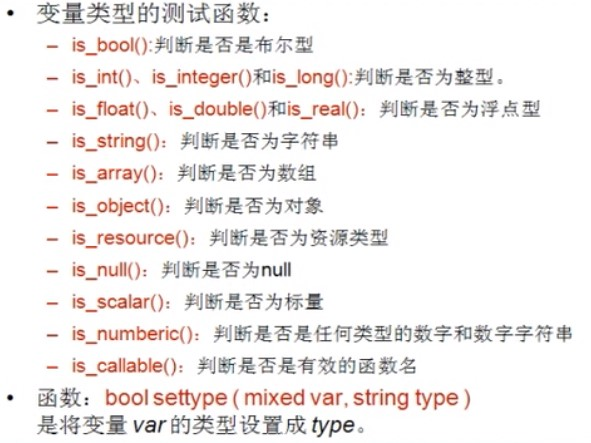

# study
php学习之路  
### Php的四对标记  
1、<?php ?>  标准  
2、  
3、<?  ?>   <?=$str ?>  需要在配置文件开启:short_open_tag=On;  
4、<%  %>   asp风格，也是兼容的，需要修改配置文件：asp_tags=On;  

### 为什么不用段标记？ 
从PHP7开始，这种写法，已经不支持了  
无论在任何时候这种<? ?> <?=?> <%=%>短标签的形式都不推荐使用，兼容性太差了，以后应该也会被废弃，也会和xml代码发生冲突  
### php文件中为什么有的php有结束符“?> ”，有的没有结束符“?> ”？  

如果是PHP和HTML混编时，一定要有结束符号?>，否则有可能导致语法错误。  
如果是一个纯粹的PHP页面，最后的结束符?>最好一定不要添加  
这样做的好处是：如果这个是一个被别人包含的程序，没有这个结束符，可以减少很多很多问题，比如说：header,  
setcookie, session_start这些动作之前不能有输出，如果不小心在?>  
后边加了不可见字符（多余的空格、换行符）等破坏页面显示，就会报”Header already  
sent”错误，不写的话不会有此问题。  

**注意**：与?>结束的语句可以不加分号，但最好加上。  
### 注释：  
	单行注释//  
	脚本注释#  
	多行注释/*   */  
	文档注释/**  */  
###  变量的声明：  
1.	变量名以$开始  
2.	变量的名称要有意义  
3.	变量名不能以数字开头，不能有运算符，尽量不使用系统关键字  
4.	变量名称区分大小写（驼峰式命名方式）  
### 至此提到需要熟悉的一些函数  
var_dump ( mixed $expression [, mixed $... ] )	输出变量的相关信息。  
bool isset ( mixed $var [, mixed $... ] )	检测变量是否设置，并且不是 NULL。  
void unset ( mixed $var [, mixed $... ] )	unset() 销毁指定的变量  
bool empty ( mixed $var )	检查一个变量是否为空  
变量不存在，null，空字符串  
### 可变变量：
	有时候使用可变变量名是很方便的。就是说，一个变量的变量名可以动态的设置和使用。一个普通的变量通过声明来设置。  
注意：在 PHP 的函数和类的方法中，超全局变量不能用作可变变量。$this 变量也是一个特殊变量，不能被动态引用。可变变量$要连在一起、  
举例：  
		$hello=”hello”  
		$$hello=”name”  
		$a$hello=”abc”这个是错误的声明  
### 变量的引用
1.	只有变量才有地址，只有变量才能引用  
2.	一个变量发生变化，另一个引用变量也会变化  
3.	在使用unset()时，如果有引用关系，只是解除了这种引用关系，只是删除一个别名，另一个还在。  
4 如果两个变量是引用关系，一个变，另一个也变，但是如果给其中一个引用，不是普通的变量，而是一个引用，则原引用关系解除，建立了新的引用关系  
### 变量的类型：
	PHP支持八种原始类型  
		四种标量类型：布尔型（boolean）整型（integer）浮点型（float）(浮点数，也做double) 字符型（string）  
		两种复合类型：数组（array）对象（object）  
		两种特殊类型：资源（resource）null  
### Boolean
 	Int 0 为假，Floot 0.00和0.0为假值，空字符串、字符串0为假，空字符串为假，空对象为真，特殊类型null为假  
### 整型：
	超过最大值变成float类型  
### 浮点型：
	浮点型是一个近似数，不要用两个浮点数比较是否相等  
### 字符串类型：
	声明一个字符串必须使用单引号或者双引号引起来  
	一个字符和多个字符都是字符串  
   #### 字符串是没有长度限制
	在单引号中可以使用双引号，在双引号中可以使用单引号  
	在单引号中不能再使用单引号，在双引号中不能再使用双引号  
	可以使用转义字符\  
### 单引号和双引号的区别
1、在双引号中可以解析变量，但是在单引号中不能解析变量     
2、在双引号中可以使用转义字符\n \r \t 在单引号中不能使用转义字符，在单引号中只能转义单引号自己和转义字符   
### 字符串定界符的声明
1.PHP定界符的作用就是按照原样，包括换行格式什么的，输出在其内部的东西；   
2.在PHP定界符中的任何特殊字符都不需要转义；   
3.PHP定界符中的PHP变量会被正常的用其值来替换。   
PHP中的定界符格式是这样的：   

<<<Eof   
……   
Eof;  
### 定界符注意事项：
1，使用三个<<<小于号  
2，在开始的定界符（自定义的字符串中）一定要左边挨着<<<，写完定界符的自定义字符串，一定要直接回车（空格都不可以）  
3，在结尾的字符串中，一定要顶头写，和开始的字符串要一致，写完直接回车  
4，使用单引号‘’在开始的定界符中，将支持双引号的功能，改成单引号的功能，例如  
$c=<<<'ABC'  
这里可以是任合内容  
我是历的苛夺基  
本原则叶落归根在运  
输费艰难田￥￥&……  
ABC;  
echo $c;  
具体参考：[参考](https://www.cnblogs.com/zywf/p/4912159.html)  
### Php数据类型之间的转换和检测
	一种强制转换  
		getType(变量)；获取变量类型  
		setType(变量，类型)   
举例：setType($int,“String”);  
将原来的变量转换了  
		在变量使用时，前面加上类型符号转	  		
			举例 $str=(string)$int;  
			在赋值时给新变量一个新类型，原变量不变  
			Intval(),floatval(),strval();  

	一种自动转换  
  
字符串强制转换为int类型  
举例：  
$a=”hello”;  
$b=(int)$a;不是以数字开头的会转换为0；只有当开头有数字才会转化为开头的数字  
  
### 常量的声明和使用：  
     ** 常量声明的时候就赋值，否则就赋不上值 **  
·	常量的声明用函数define()；举例：define(“ROOT”,100);  
·	如果常量没有声明，则常量名称在使用时会自动转换为字符串（效率很低）  
·	常量名称不要加$符号  
·	常量的名称，默认是区分大小写的，习惯上常量名称全部使用大写  
·	可以使用define();第三个参数来决定是否区分大小写，true不区分大小写，false区分  
·	举例：define(“ROOT”,100,true);root不区分大小写  
·	常量的值支支持标量数据类型  
·	常量不能使用unset()清楚一个常量  
·	常量可以使用defined();判断一个常量是否存在  
·	**举例：**  
If(defined(“ROOT”)){  
	Echo “常量存在”；  
	Echo constant(“ROOT”); 也可以输出常量，不常用  
}  
用get_defined_constants()可以获得所有已定义的常量列表  
### Php预定义常量  
例如：M_PI  
1. \__LINE\__  
返回文件中的当前行号。  
2. \__FILE\__
返回所在文件的完整路径。包含文件名  
3. \__FUNCTION\__  
返回所在函数名称。  
4. \__CLASS\__  
返回所在类的名称。  
5. \__METHOD\__  
返回所在类方法的名称。需要注意\__METHOD\__返回的是"class::function"的形式，而\__FUNCTION\__则返回"function"的形式。  
6.\__DIR\__  
返回文件所在的目录。如果用在被包括文件中，则返回被包括的文件所在的目录。它等价于 dirname(__FILE__)。除非是根目录，否则目录中名不包括末尾的斜杠。不包含文件名。（PHP 5.3.0中新增） = 
7.\__NAMESPACE\__  
当前命名空间的名称（区分大小写）。此常量是在编译时定义的（PHP 5.3.0 新增）。    
8.\__TRAIT\__  
Trait 的名字（PHP 5.4.0 新加）。自 PHP 5.4 起此常量返回 trait 被定义时的名字（区分大小写）。Trait 名包括其被声明的作用区域（例如 Foo\Bar）  
Php运算符号：https://www.cnblogs.com/qiandu23/p/5922266.html  
	取模运算符 % 的结果取决于除数的正负  
echo (5 % 3)."\n";    2           
echo (5 % -3)."\n";   2        
echo (-5 % 3)."\n";  -2          
echo (-5 % -3)."\n";  -2  
mod($x, $y) fmod() 函数返回除法的浮点数余数。  

$a=true;echo $a；输出1  
$a=false;echo $a；输出空  

$a=true;  
$a++;         //$a=$a+1; 会输出int(2),细节问题   
Var_dump($a); //输出boole true，boolean型不参与++运算  

$a = ‘abc’;  
$a++ ；  
字符串中的++/--是按照字符串的升序/降序  
赋值运算符号  
	.=  
比较运算符  
	>、<、=、！=、<>、==、===、！==、  
	两个对等号比较的是内容，三个等号比较的不光内容相等，类型也要相同  
	！==非全等于，两边的类型和内容都相同时返回false,否则返回true  
逻辑运算符  
	and或&&  
	or或||  
	not或！  
	Xor  逻辑异或 当两边操作数只有一个为true时，返回true，否则返回false  
### 短路：  
举例：  
Die(“输出并退出应用程序”);  
$link=mysql_connect(“localhost”,”root”,”root”) or die(“数据库连接失败 ”);  

<?php  
//逻辑运算符的短路特性：  
//例1:$a>5&&$a<100，如果$a=2,则此时只会执行到$a>5返回假值，后面的不用执行；  
//例2:$a>5||$a<100,如果$a=6,则此时只会执行到$a>5返回真值，后面的也不必执行，所以叫短路；  
$a=0;$b=0;  
if($a=3&&$b=3)   
{  
$a++;  
$b++;  
}  
var_dump($a)." "; //输出 bool true  
var_dump($b)." "; //输出 int 4  
/*注解:$a=3&&$b=3时，由于是赋值语句，且赋值语句的优先级低于逻辑运算符，故会先执行后面的3&&$b=3  
这一块并且会把3的值赋给$b,所以整个表达式的值为真，执行自加语句；  
*/  

$a=0;$b=0;  
if($a=3||$b=3)  
{  
$a++;  
$b++;  
}  
var_dump($a)." ";//输出 bool true;  
var_dump($b)." ";//输出 int 1;  

**注解:$a=3||$b=3时，由于是赋值语句，且赋值语句的优先级低于逻辑运算符，故会先执行后面的3||$b=3  
这一块且不会执行$b=3(短路特性),所以整个表达式的值为真，执行自加语句；**  
 
?>  
位运算符 (不会短路)  
运算符：&（按位与），|（按位或），^(按位异或)，\~(按位取反)  
&（按位与）：对应位同时为1时，在&运算后则为1，否则为0  
|（按位或）：对应位有一个为1时，在|运算后则为1，同为0时则为0  
^(按位异或)：对应位不同时为1时，在^运算后为1，同时为0时则为0，同时为1时^运算后也是0  
\~(按位取反)：$a+(\~$a)=-1  
在计算机中，负数以其正值的补码形式表达。  
 在这里我们就要知道三个概念了，原码，反码和补码。  
原码：一个整数，按照绝对值大小转换成的二进制数，称为原码。  
8的原码为：0000 0000 0000 0000 0000 0000 0000 1000  
反码：将二进制数按位取反，所得的新二进制数称为原二进制数的反码。取反操作指：1变0， 0变1。  
8按位取反：1111 1111 1111 1111 1111 1111 1111 0111  
补码：反码加1称为补码。也就是说，要得到一个数的补码，先得到反码，然后将反码加上1，所得数称为补码。  
正数的补码与其原码相同；负数的补码是在其反码的末位加1  
反码加1：1000 0000 0000 0000 0000 0000 000 1001；这样就得负数的正值的补码形式。也就是-9了。  
参考：http://www.cnblogs.com/setsail/archive/2013/05/22/3093542.html  
　　 http://my.oschina.net/WarRome/blog/90707  
以上解释自己也没有看的太懂，但实践得出$a+(\~$a)=-1  
小例如下：  
<?php  
$m=8;  
$n=12;  
$p=-109;  
$mn=$m&$n;  
echo $mn." ";  
$mn=$m|$n;  
echo $mn." ";  
$mn=$m^$n;  
echo $mn." ";  
$mn=~$m;  
echo $mn." ";  
$mn=~$p;  
echo $mn." ";  
?>  
输出结果：  
8  
12  
4  
-9  
108  
关于按位取反的问题，再琢磨琢磨  
if判断的条件中，如果条件是非0的正数或者负数，那么if中的代码都能执行，如果if为0则不执行，加上！则相反   
其他运算符：  

PHP多条件分支   
		   在switch()括号中，必须是一个变量  
   在seitch(){}中放的是多个case语句，case空格，后面放的是值，值后面用一个冒号：  
   可以使用default在没有匹配值得时候，默认执行  
					   Switch (变量){  
				         Case 值1：  
						                 语句；  
					                  Break;  
          Case 值2：  
                   语句；  
                    Break;  
           Default   
                    语句；   
                    Break;  
}  
注意：switch(变量) 变量的类型只允许两种：整型和字符串  
Break是退出switch结构使用的，如果需要匹配多个值，可以使用多个case,而不加break  
使用时间：单个值匹配进行分支时使用switch case   else if 判断范围时使用  
巢装分支：  
循环结构：  
														      While(表达式){语句}  
      Do{语句}while(表达式);  

for(表达式一；表达式二；表达式三){  
循环体；  
}  
执行顺序：表达式一  
           表达式二  
           循环体  
            表达式三  
            表达式二  
注意：表达式一只执行一次，初始化条件 $i=0  
      表达式二：条件表达式，成立则执行循环体 $i<100  
      表达式三：是一个自增条件$i++  

		

