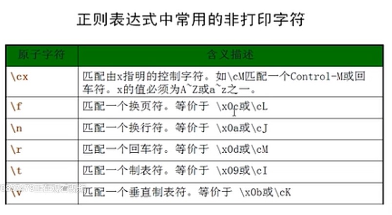
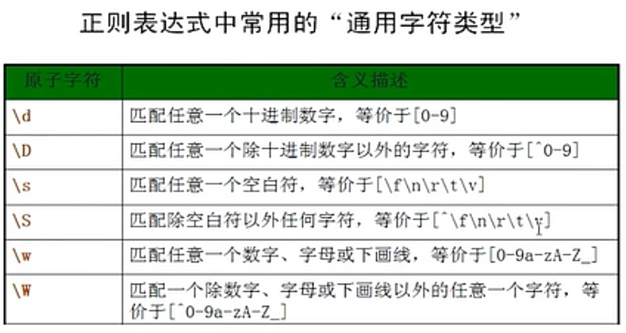
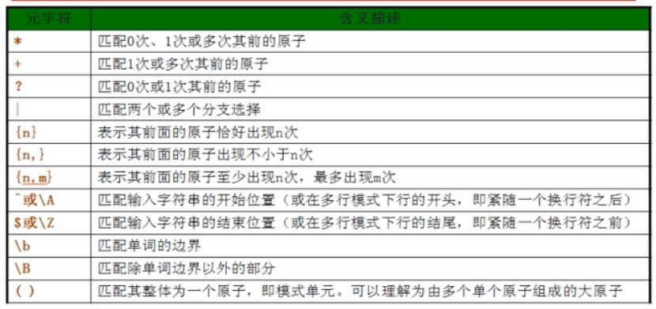
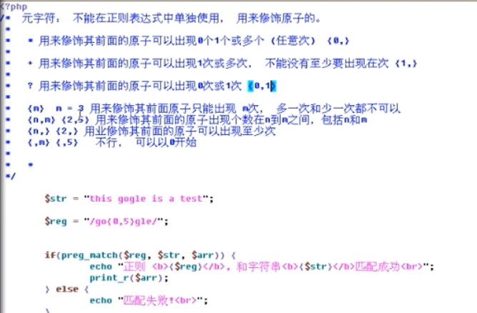

## 正则表达式  
1、	正则表达式就是一个匹配的模式  
2、	正则表达式本身就是一个字符串（中有一些语法规则，特殊字符）  
3、	正则表达式这个字符串一定要对应的函数中使用（分割的函数，替换的函数）  
**定界符**：多种都可以，常为//，除了字母，数字，斜线，\以外的任何字符都可以作为定界符。  
**原子**： 最少的一个匹配单位（放在定界符中），在一个正则表达式中，至少要有一个原子。  
**元字符**：不能单独使用，修饰原子，用来扩展原子功能的和限定功能（写在定界符中）  
**模式修正符**：修正，对模式（正则）修正，自而在定界符号外，写在右边  

#### 替换：preg_replace(匹配规则，替换成，操作的数据)；  
#### 分割：preg_split(匹配规则，操作的数据);  
int preg_match( string pattern, string subject [, array matches ] )函数用于进行正则表达式匹配，成功返回 1 ，否则返回 0 。  
preg_match() 第一次匹配成功后就会停止匹配，如果要实现全部结果的匹配，即搜索到subject结尾处，则需使用preg_match_all() 函数。  
[参考](http://www.cnblogs.com/52php/p/5677640.html)  
### 原子：  
## 1打印字符（a-z,A-Z,0-9,!@#$%^&*()_），和非打印字符  
\转义字符：  
一．可以将有意义的字符转换成无意义的原字符  
二．可以将没有意义的字符转成有意义的原子  
三．所有没有一生有意义的字符，加上转义也没有意义的，\@都是可加可不加的  
四. 
## 2.	所有的数字，所有的字，所有的空白，所有的字母，特殊符号、
\d  代表任意一个数字    [0-9]        \D代表任意一个非数字  [^0-9]  
\w 代表任意一个字，A-Z, a-z,0-9   [a-zA-Z0-9]      \W 代表人一个非数字，除了A-Z, a-z,0-9之外的所有字符     [^a-zA-Z0-9]  
\s  代表空白     [\t\n\f\v]                \S代表一个非空白   [^\t\n\f\v]  
自定义原子表[]    ^除了列表中的 举例：[^a-zA-Z]  
点(.)代表所有的  
  
##元字符
  
元字符不能再正则表达式中单独使用，用来修饰原子的。  
*用来修饰其前面的原子可以出现0个1个或多个  

